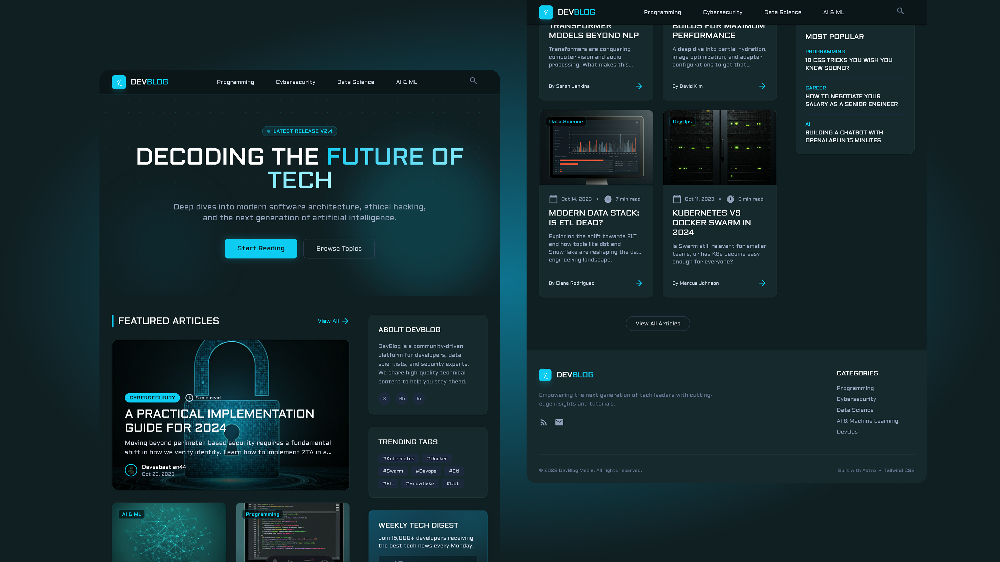
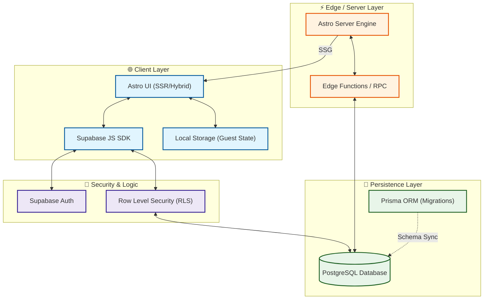

# 🚀 DevBlog - Modern Tech & Architecture Blog

<p align="center">
  
</p>

DevBlog is a high-performance, premium tech blog built for deep dives into software architecture, ethical hacking, and AI. It features a futuristic dark aesthetic, interactive guest features, and a robust authentication system.

## 🛠️ Tech Stack


- **[Astro 5.0+](https://astro.build/)**: The web framework for content-driven websites. Focused on performance with zero-JavaScript by default.
- **[Supabase](https://supabase.com/)**: Backend-as-a-Service providing PostgreSQL database, Secure Auth, and Real-time capabilities.
- **[Tailwind CSS 4.0](https://tailwindcss.com/)**: A utility-first CSS framework for rapid UI development with a custom premium design system.
- **[Vite](https://vitejs.dev/)**: Next-generation frontend tooling for a fast development experience.
- **[TypeScript](https://www.typescriptlang.org/)**: Static type checking for robust and maintainable code.

## 🏗️ System Architecture

DevBlog follows a modern decoupled architecture, combining static content with dynamic real-time features.

### 🧩 Architecture Diagram



### ⚙️ How it works:
- **Static First**: Blog posts are pre-rendered during build time for maximum speed and SEO.
- **Dynamic Layers**: Interactivity (Likes, Comments, Bookmarks) is handled via client-side scripts connecting directly to Supabase.
- **Secure Auth**: User management and the "Danger Zone" use Supabase Auth and secure PostgreSQL functions.
- **Data Integrity**: Prisma handles the schema definitions and migrations, while Supabase RLS ensures only authorized users can modify their data.

## 📂 Project Structure

The project follows a modular and organized structure:

```text
/
├── src/
│   ├── components/       # Reusable UI components (ArticleCard, Sidebar, etc.)
│   │   ├── PostSidebarLeft.astro   # Interactive sidebar (Likes, Comments, Bookmarks)
│   │   ├── Comments.astro          # Real-time-ready comment system
│   │   └── Header.astro            # Dynamic navigation and user menu
│   ├── content/          # Markdown/MDX content for blog posts
│   ├── layouts/          # Base HTML structures (Layout.astro)
│   ├── lib/              # Utility configurations (Supabase client)
│   ├── pages/            # View routes (Home, Login, Settings, Activity)
│   │   ├── posts/        # Dynamic blog post routes
│   │   └── settings.astro # Account management (Update profile, Delete account)
│   └── styles/           # Global design tokens and Tailwind configuration
├── public/               # Static assets (images, icons)
└── package.json          # Project dependencies and scripts
```

## ✨ Key Features

- **Interactive Post Sidebar**: Real-time counter for Likes, Comments, and Bookmarks.
- **Guest Support**: Anonymous users can interact (likes, favorites, comments) via local tracking.
- **Advanced Auth**: Secure Registration, Login, and personalized "My Activity" pages.
- **Danger Zone**: A secure, custom-built account deletion flow with anti-cache RPC logic.
- **Premium UI**: Futuristic design with Aldrich typography, glassmorphism, and smooth transitions.

## 🚀 Getting Started

1. **Install dependencies**:
   ```bash
   npm install
   ```

2. **Configure environment**:
   Create a `.env` file with your Supabase credentials:
   ```env
   PUBLIC_SUPABASE_URL=your_url
   PUBLIC_SUPABASE_ANON_KEY=your_key
   ```

3. **Run development server**:
   ```bash
   npm run dev
   ```

## 🚀 Deployment (Vercel)

1.  **Environment Variables**: In your Vercel project settings, add the following:
    - `PUBLIC_SUPABASE_URL`: Your Supabase Project URL.
    - `PUBLIC_SUPABASE_ANON_KEY`: Your Supabase Anonymous API Key.
2.  **Redeploy**: Ensure you redeploy the project after adding these variables to apply the changes.

## 🤝 Contributing

Developed with ❤️ for the Tech Community.

---

📜 Licencia

Este proyecto está bajo la licencia MIT. Puedes usarlo libremente, siempre citando al autor.
